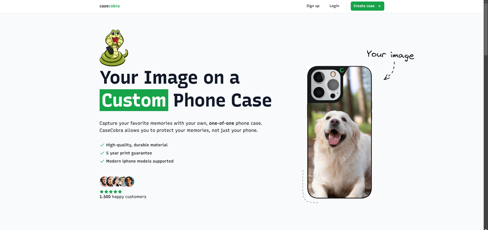

  
  
  
  
  

 
 

  

  <h1 align="center">Phone Case Store</h1>
  
Create custom phone cases by uploading images, customizing materials, colors, and more! Try the demo now!

  

     
    <a href="https://casestore.vercel.app/">View Demo</a> 
    &middot;
    <a href="mailto:juanillaberia2002@gmail.com">Contact us</a>
  

## About The Project

**PhoneCase-Store** is a **fake e-commerce store** for creating custom phone cases.  
Upload your image, customize the case's material, color, and phone model, position the image how you like, and complete a **simulated payment** process. It's the perfect place to design your dream phone case for fun!

 

## 🌟 Why PhoneCase-Store?  

🎨 **Customizable Designs** – Upload images and adjust phone case colors, materials, and image position  
💳 **Fake Payment System** – Simulate a purchase to process your custom phone case order  
⚡ **Fast & Interactive** – Customize your case quickly with a smooth and responsive interface  
🚀 **Easy to Use** – No coding required! Just upload your image and start designing  

 

## 🚀 Get Started  

1️⃣ **Upload your image** to create the design for your phone case  
2️⃣ **Customize** the material, color, and phone model for your case  
3️⃣ **Position the image** to match your design vision  
4️⃣ **Simulate the payment process** to finalize your custom order  
5️⃣ **Enjoy your virtual phone case design!**  

> **💡 Create a fun and unique phone case design without spending a dime!**  

 

## 📌 Features  

✅ **Image Upload** – Easily upload images for your custom phone case design  
✅ **Customizable Case** – Choose material, color, and phone model for your case  
✅ **Image Positioning** – Drag and drop to position your image perfectly  
✅ **Simulated Payment** – Fake payment processing to complete the order  
✅ **Smooth User Experience** – Fast, responsive, and easy to use interface  

 

## 🛠 Built With  

  
  
  
  
  
  
  

 

Thanks to <a href="https://www.youtube.com/@joshtriedcoding">Josh Tried Coding</a> for the amazing course project!
